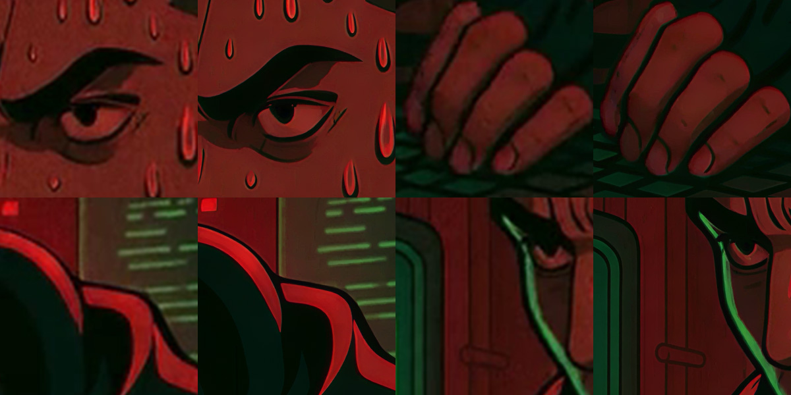
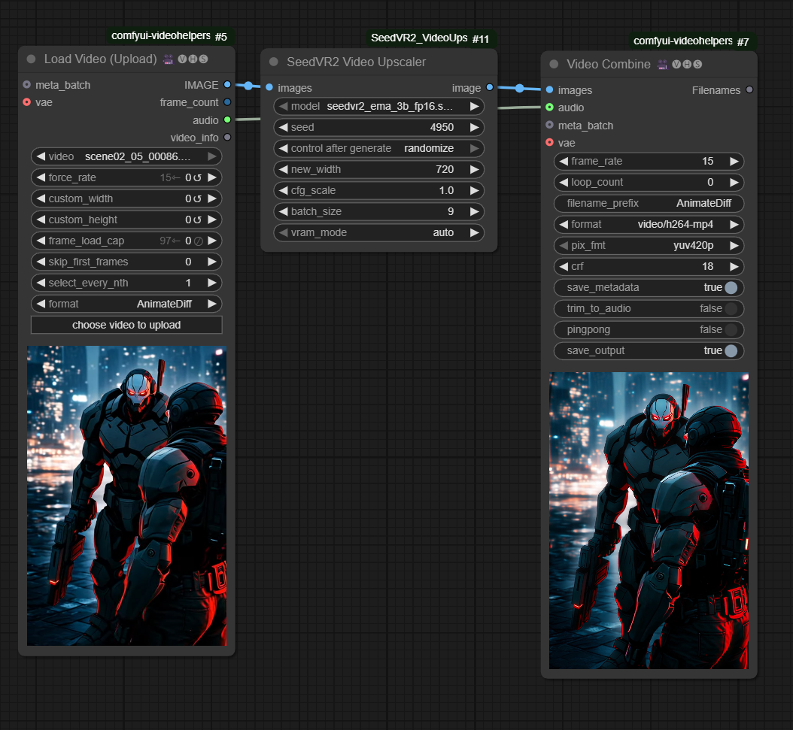
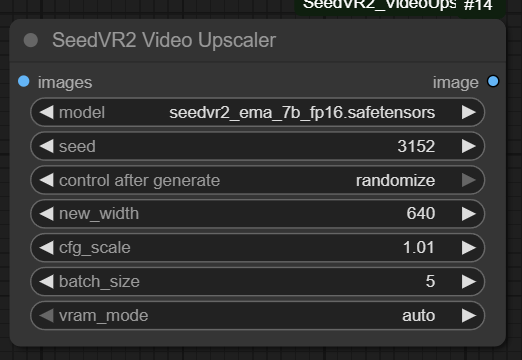
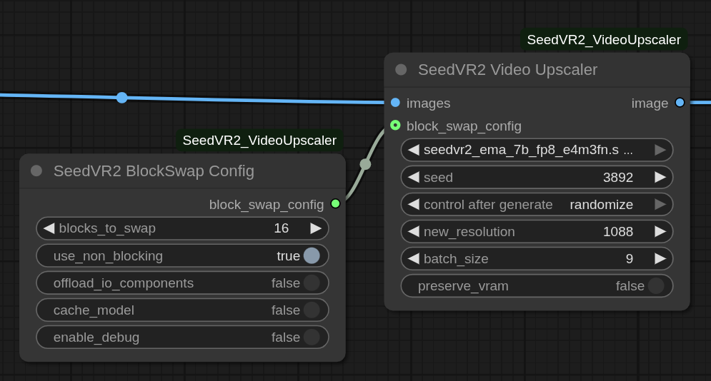

# ComfyUI-SeedVR2_VideoUpscaler

[](https://github.com/numz/ComfyUI-SeedVR2_VideoUpscaler)

Official release of [SeedVR2](https://github.com/ByteDance-Seed/SeedVR) for ComfyUI that enables Upscale Video/Images generation.

Can run as **Multi-GPU standalone** too, see [🖥️ Run as Standalone](#️-run-as-standalone) section.






## 📋 Quick Access

- [🆙 Note and futur releases](#-note-and-futur-releases)
- [🚀 Updates](#-updates)
- [🎯 Features](#-features)
- [🔧 Requirements](#-requirements)
- [📦 Installation](#-installation)
- [📖 Usage](#-usage)
- [🖥️ Run as Standalone](#️-run-as-standalone)
- [📊 Benchmarks](#-benchmarks)
- [⚠️ Limitations](#-Limitations)
- [🤝 Contributing](#-contributing)
- [🙏 Credits](#-credits)
- [📄 License](#-license)

## 🆙 Note and futur releases

- Improve FP8 integration, we are loosing some FP8 advantages during the process.
- Tile-VAE integration if it works for video, I have test to do or if some dev want help, you are welcome.
- 7B FP8 model seems to have quality issues, use 7BFP16 instead (If FP8 don't give OOM then FP16 will works) I have to review this.

## 🚀 Updates

**2025.07.17**

- 🛠️ Add 7B sharp Models: add 2 new 7B models with sharpen output

**2025.07.11**

- 🎬 Complete tutorial released: Adrien from [AInVFX](https://www.youtube.com/@AInVFX) created an in-depth ComfyUI SeedVR2 guide covering everything from basic setup to advanced BlockSwap techniques for running on consumer GPUs. Perfect for understanding memory optimization and upscaling of image sequences with alpha channel! [Watch the tutorial](#-usage)

**2025.09.07**

- 🛠️ Blockswap Integration: Big thanks to [Adrien Toupet](https://github.com/adrientoupet) from [AInVFX](https://www.youtube.com/@AInVFX) for this :), usefull for low VRAM users (see [usage](#-usage) section)

**2025.07.03**

- 🛠️ Can run as **standalone mode** with **Multi GPU** see [🖥️ Run as Standalone](#️-run-as-standalone)

**2025.06.30**

- 🚀 Speed Up the process and less VRAM used (see new benchmark).
- 🛠️ Fixed leak memory on 3B models.
- ❌ Can now interrupt process if needed.
- ✅ refactored the code for better sharing with the community, feel free to propose pull requests.
- 🛠️ Removed flash attention dependency (thanks to [luke2642](https://github.com/Luke2642) !!)

**2025.06.24**

- 🚀 Speed up the process until x4 (see new benchmark)

**2025.06.22**

- 💪 FP8 compatibility !
- 🚀 Speed Up all Process
- 🚀 less VRAM consumption (Stay high, batch_size=1 for RTX4090 max, I'm trying to fix that)
- 🛠️ Better benchmark coming soon

**2025.06.20**

- 🛠️ Initial push

## 🎯 Features

- High-quality Upscaling
- Suitable for any video length once the right settings are found
- Model Will Be Download Automatically from [Models](https://huggingface.co/numz/SeedVR2_comfyUI/tree/main)
- Standalone mode

## 🔧 Requirements

- A Huge VRAM capabilities is better, from my test, even the 3B version need a lot of VRAM at least 18GB.
- Last ComfyUI version with python 3.12.9 (may be works with older versions but I haven't test it)

## 📦 Installation

Directly accessible from Comfyui-Manager, search "seedvr2" and click "Install" and restart.

OR

1. Clone this repository into your ComfyUI custom nodes directory:

```bash
cd ComfyUI/custom_nodes
git clone https://github.com/numz/ComfyUI-SeedVR2_VideoUpscaler.git
```

2. Install the required dependencies:

load venv and :

```bash
pip install -r ComfyUI-SeedVR2_VideoUpscaler/requirements.txt
```

install flash_attn/triton, 6% faster on process, not a mandatory.

```bash
pip install flash_attn
pip install triton
```

or

```bash
python_embeded\python.exe -m pip install -r flash_attn
```

check here from https://github.com/loscrossos/lib_flashattention/releases and https://github.com/woct0rdho/triton-windows

3. Models

   Will be automtically download into :
   `models/SEEDVR2`

   or can be found here ([MODELS](https://huggingface.co/numz/SeedVR2_comfyUI/tree/main))

## 📖 Usage

### 🎬 Video tutorial

Learn everything about SeedVR2 in this comprehensive tutorial by Adrien from [AInVFX](https://www.youtube.com/@AInVFX), covering ComfyUI setup, BlockSwap for consumer GPUs, alpha workflows, and production tips:

[](https://youtu.be/I0sl45GMqNg)

### Node setup

1. In ComfyUI, locate the **SeedVR2 Video Upscaler** node in the node menu.



2. ⚠️ **THINGS TO KNOW !!**

**temporal consistency** : at least a **batch_size** of 5 is required to activate temporal consistency. SEEDVR2 need at least 5 frames to calculate it. A higher batch_size give better performances/results but need more than 24GB VRAM.

**VRAM usage** : The input video resolution impacts VRAM consumption during the process. The larger the input video, the more VRAM will consume during the process. So, if you experience OOMs with a batch_size of at least 5, try reducing the input video resolution until it resolves.

Of course, the output resolution also has an impact, so if your hardware doesn't allow it, reduce the output resolution.

3. Configure the node parameters:

   - `model`: Select your 3B or 7B model
   - `seed`: a seed but it generate another seed from this one
   - `new_resolution`: New desired short edge in px, will keep ratio on other edge
   - `batch_size`: VERY IMPORTANT!, this model consume a lot of VRAM, All your VRAM, even for the 3B model, so for GPU under 24GB VRAM keep this value Low, good value is "1" without temporal consistency, "5" for temporal consistency, but higher is this value better is the result.
   - `preserve_vram`: for VRAM < 24GB, If true, It will unload unused models during process, longer but works, otherwise probably OOM with
   
4. 🧩 **BlockSwap Configuration (Optional - For Limited VRAM)**

   

   BlockSwap enables running large models on GPUs with limited VRAM by dynamically swapping transformer blocks between GPU and CPU memory during inference.

   **To enable BlockSwap:**
   - Add the **SEEDVR2 BlockSwap Config** node to your workflow
   - Connect its output to the `block_swap_config` input of the SeedVR2 Video Upscaler node

   **BlockSwap parameters:**
   - `blocks_to_swap` (0-32 for 3B model, 0-36 for 7B model): Number of transformer blocks to offload
     - 0 = Disabled (fastest, highest VRAM)
     - 16 = Balanced (moderate speed/VRAM trade-off)
     - 32-36 = Maximum savings (slowest, lowest VRAM)
   - `offload_io_components`: Move embeddings/IO layers to CPU (additional VRAM savings, slower)
   - `use_non_blocking`: Asynchronous GPU transfers (keep True for better performance)
   - `cache_model`: Keep model in RAM between runs (faster for batch processing)
   - `enable_debug`: Show detailed memory usage and timing

   **Finding optimal settings:**
   - Start with `blocks_to_swap=16`, increase if you get OOM errors, decrease if you have spare VRAM
   - Enable debug mode to monitor memory usage
   - The first 1-2 blocks might show longer swap times - this is normal
   - Combine with `preserve_vram=True` for maximum memory savings

## 🖥️ Run as Standalone

You can also run SeedVR2 Video Upscaler as a standalone Multi-GPU support script without ComfyUI. This is useful for batch processing or when you prefer command-line operation or want to use multi-GPU.

### Prerequisites for Standalone

1. Need python 3.12.9 (I haven't test with other version, must works)
2. **clone the repository**

```
git clone https://github.com/numz/ComfyUI-SeedVR2_VideoUpscaler SeedVR2_VideoUpscaler
cd SeedVR2_VideoUpscaler
```

3. **install python and create env** prefer python 3.12.9

```

conda create -n seedvr python=3.12.9
conda activate seedvr

or

python -m venv venv

windows :
.\venv\Scripts\activate

linux :
source ./venv/bin/activate
```

2. **Install requirements** for standalone operation:

```
pip install torch==2.6.0 torchvision==0.21.0 torchaudio==2.6.0 --index-url https://download.pytorch.org/whl/cu126
pip install -r requirements.txt
```

### Comandline Usage

```
usage: inference_cli.py [-h]
   --video_path VIDEO_PATH
   [--seed SEED]
   [--resolution RESOLUTION]
   [--batch_size BATCH_SIZE]
   [--model {
      seedvr2_ema_3b_fp16.safetensors,
      seedvr2_ema_3b_fp8_e4m3fn.safetensors,
      seedvr2_ema_7b_fp16.safetensors,
      seedvr2_ema_7b_fp8_e4m3fn.safetensors}]
   [--model_dir MODEL_DIR]
   [--skip_first_frames SKIP_FIRST_FRAMES]
   [--load_cap LOAD_CAP]
   [--output OUTPUT]
   [--output_format {video,png}]
   [--cuda_device CUDA_DEVICE]
   [--preserve_vram]
   [--debug]


options:
  -h, --help                              show this help message and exit
  --video_path VIDEO_PATH                 Path to input video file
  --seed SEED                             Random seed for generation (default: 100)
  --resolution RESOLUTION                 Target resolution width (default: 1072)
  --batch_size BATCH_SIZE                 Number of frames per batch (default: 5)
  --model                                 Model to use (default: 3B FP8) in list:
                                             seedvr2_ema_3b_fp16.safetensors,
                                             seedvr2_ema_3b_fp8_e4m3fn.safetensors,
                                             seedvr2_ema_7b_fp16.safetensors,
                                             seedvr2_ema_7b_fp8_e4m3fn.safetensors
  --model_dir MODEL_DIR                   Directory containing the model files (default: seedvr2_models)
  --skip_first_frames SKIP_FIRST_FRAMES   Skip the first frames during processing
  --load_cap LOAD_CAP                     Maximum number of frames to load from video (default: load all)
  --output OUTPUT                         Output video path (default: auto-generated)
  --output_format {video,png}             Output format: 'video' (mp4) or 'png' images (default: video)
  --cuda_device CUDA_DEVICE               CUDA device id(s). Single id (e.g., '0') or comma-separated list '0,1' for multi-GPU
  --preserve_vram                         Enable VRAM preservation mode
  --debug                                 Enable debug logging

```

Examples :

```
# Upscale 18 frames as png
python inference_cli.py --video_path "MAIN.mp4" --resolution 1072 --batch_size 9 --model seedvr2_ema_3b_fp8_e4m3fn.safetensors --model_dir ./models\SEEDVR2 --load_cap 18 --output "C:\Users\Emmanuel\Downloads\test_upscale" --output_format png --preserve_vram

# Upscale 1000 frames on 4 GPU, each GPU will receive 250 frames and will process them 50 by 50
python inference_cli.py --video_path "MAIN.mp4" --batch_size 50 --load_cap 1000 --output ".\outputs\test_upscale.mp4" --cuda_device 0,1,2,3

```

## 📊 Benchmarks

**7B models on NVIDIA H100 93GB VRAM** (values in parentheses are from the previous benchmark):

| nb frames | Resolution          | Batch Size | execution time fp8 (s) | FPS fp8     | execution time fp16 (s) | FPS fp16           | perf progress since start |
| --------- | ------------------- | ---------- | ---------------------- | ----------- | ----------------------- | ------------------ | ------------------------- |
| 15        | 512×768 → 1080×1620 | 5          | 23.75 (26.71)          | 0.63 (0.56) | 24.23 (27.75)           | 0.61 (0.54) (0.10) | x6.1                      |
| 27        | 512×768 → 1080×1620 | 9          | 27.75 (33.97)          | 0.97 (0.79) | 28.48 (35.08)           | 0.94 (0.77) (0.15) | x6.2                      |
| 39        | 512×768 → 1080×1620 | 13         | 32.02 (41.01)          | 1.21 (0.95) | 32.62 (42.08)           | 1.19 (0.93) (0.19) | x6.2                      |
| 51        | 512×768 → 1080×1620 | 17         | 36.39 (48.12)          | 1.40 (1.06) | 37.30 (49.44)           | 1.36 (1.03) (0.21) | x6.4                      |
| 63        | 512×768 → 1080×1620 | 21         | 40.80 (55.40)          | 1.54 (1.14) | 41.32 (56.70)           | 1.52 (1.11) (0.23) | x6.6                      |
| 75        | 512×768 → 1080×1620 | 25         | 45.37 (62.60)          | 1.65 (1.20) | 45.79 (63.80)           | 1.63 (1.18) (0.24) | x6.8                      |
| 123       | 512×768 → 1080×1620 | 41         | 62.44 (91.38)          | 1.96 (1.35) | 62.28 (92.90)           | 1.97 (1.32) (0.28) | x7.0                      |
| 243       | 512×768 → 1080×1620 | 81         | 106.13 (164.25)        | 2.28 (1.48) | 104.68 (166.09)         | 2.32 (1.46) (0.31) | x7.4                      |
| 363       | 512×768 → 1080×1620 | 121        | 151.01 (238.18)        | 2.40 (1.52) | 148.67 (239.80)         | 2.44 (1.51) (0.33) | x7.4                      |
| 453       | 512×768 → 1080×1620 | 151        | 186.98 (296.52)        | 2.42 (1.53) | 184.11 (298.65)         | 2.46 (1.52) (0.33) | x7.4                      |
| 633       | 512×768 → 1080×1620 | 211        | 253.77 (406.65)        | 2.49 (1.56) | 249.43 (409.44)         | 2.53 (1.55) (0.34) | x7.4                      |
| 903       | 512×768 → 1080×1620 | 301        | OOM (OOM)              | (OOM)       | OOM (OOM)               | (OOM) (OOM)        |                           |
| 149       | 854x480 → 1920x1080 | 149        |                        |             | 450.22                  | 0.41               |                           |

**3B FP8 models on NVIDIA H100 93GB VRAM** (values in parentheses are from the previous benchmark):

| nb frames | Resolution          | Batch Size | execution time fp8 (s) | FPS fp8 | execution time fp16 (s) | FPS fp16 |
| --------- | ------------------- | ---------- | ---------------------- | ------- | ----------------------- | -------- |
| 149       | 854x480 → 1920x1080 | 149        | 361.22                 | 0.41    |                         |          |

**NVIDIA RTX4090 24GB VRAM**

| Model   | nb frames | Resolution          | Batch Size | execution time (seconds) | FPS         | Note                                     |
| ------- | --------- | ------------------- | ---------- | ------------------------ | ----------- | ---------------------------------------- |
| 3B fp8  | 5         | 512x768 → 1080x1620 | 1          | 14.66 (22.52)            | 0.34 (0.22) |                                          |
| 3B fp16 | 5         | 512x768 → 1080x1620 | 1          | 17.02 (27.84)            | 0.29 (0.18) |                                          |
| 7B fp8  | 5         | 512x768 → 1080x1620 | 1          | 46.23 (75.51)            | 0.11 (0.07) | preserve_memory=on                       |
| 7B fp16 | 5         | 512x768 → 1080x1620 | 1          | 43.58 (78.93)            | 0.11 (0.06) | preserve_memory=on                       |
| 3B fp8  | 10        | 512x768 → 1080x1620 | 5          | 39.75                    | 0.25        | preserve_memory=on                       |
| 3B fp8  | 100       | 512x768 → 1080x1620 | 5          | 322.77                   | 0.31        | preserve_memory=on                       |
| 3B fp8  | 1000      | 512x768 → 1080x1620 | 5          | 3624.08                  | 0.28        | preserve_memory=on                       |
| 3B fp8  | 20        | 512x768 → 1080x1620 | 1          | 40.71 (65.40)            | 0.49 (0.31) |                                          |
| 3B fp16 | 20        | 512x768 → 1080x1620 | 1          | 44.76 (91.12)            | 0.45 (0.22) |                                          |
| 3B fp8  | 20        | 512x768 → 1280x1920 | 1          | 61.14 (89.10)            | 0.33 (0.22) |                                          |
| 3B fp8  | 20        | 512x768 → 1480x2220 | 1          | 79.66 (136.08)           | 0.25 (0.15) |                                          |
| 3B fp8  | 20        | 512x768 → 1620x2430 | 1          | 125.79 (191.28)          | 0.16 (0.10) | preserve_memory=off (preserve_memory=on) |
| 3B fp8  | 149       | 854x480 → 1920x1080 | 5          | 782.76                   | 0.19        | preserve_memory=on                       |

## ⚠️ Limitations

- Use a lot of VRAM, it will take all!!
- Processing speed depends on GPU capabilities

## 🤝 Contributing

Contributions are welcome! Please feel free to submit a Pull Request. For major changes, please open an issue first to discuss what you would like to change.

Please make sure to update tests as appropriate.

### How to contribute:

1. Fork the repository
2. Create your feature branch (`git checkout -b feature/AmazingFeature`)
3. Commit your changes (`git commit -m 'Add some AmazingFeature'`)
4. Push to the branch (`git push origin feature/AmazingFeature`)
5. Open a Pull Request

### Development Setup:

1. Clone the repository
2. Install dependencies
3. Make your changes
4. Test your changes
5. Submit a pull request

### Code Style:

- Follow the existing code style
- Add comments for complex logic
- Update documentation if needed
- Ensure all tests pass

### Reporting Issues:

When reporting issues, please include:

- Your system specifications
- ComfyUI version
- Python version
- Error messages
- Steps to reproduce the issue

## 🙏 Credits

- Original [SeedVR2](https://github.com/ByteDance-Seed/SeedVR) implementation

# 📜 License

- The code in this repository is released under the MIT license as found in the [LICENSE file](LICENSE).

```

```
